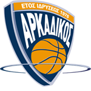
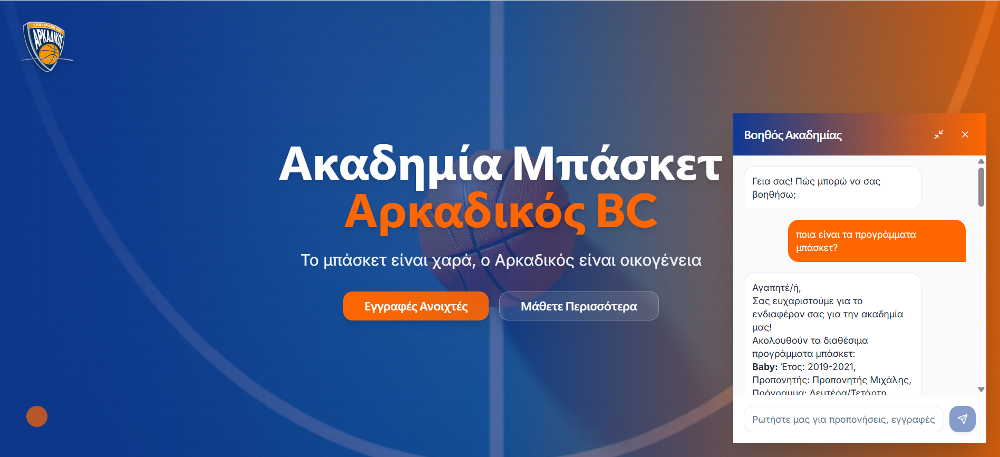
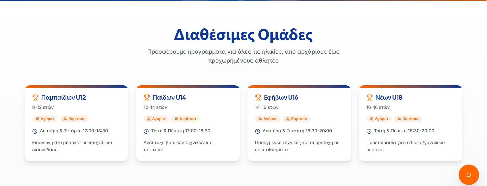
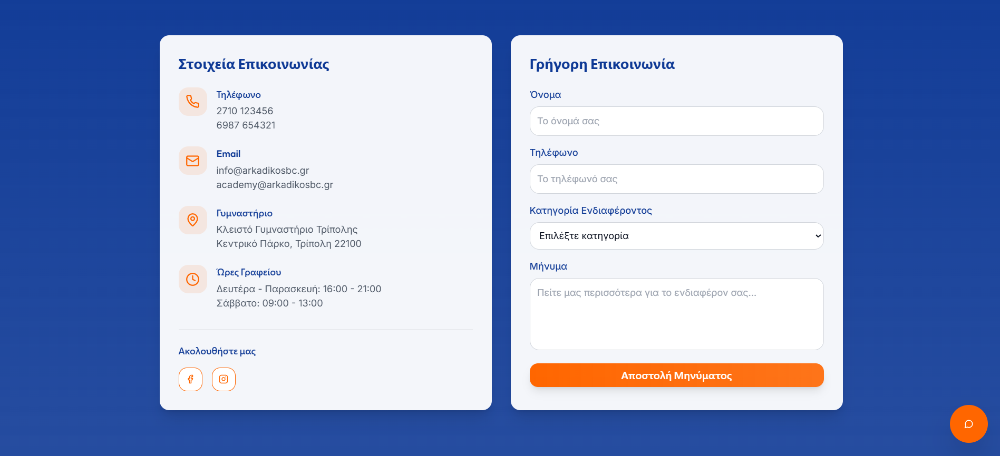
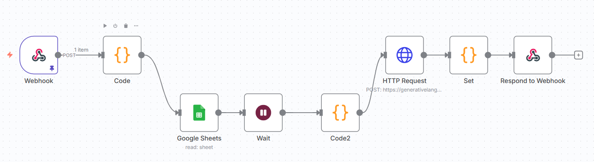

<p align="center">
  
</p>

# Αρκαδικός BC Basketball Academy AI Agent

Welcome to the official web platform for the Αρκαδικός BC Basketball Academy!  
This project combines a beautiful, modern React frontend with an AI-powered chatbot and dynamic team/program information.

---


<p align="center">
  
</p>

# Αρκαδικός BC Basketball Academy AI Agent

Welcome to the official web platform for the Αρκαδικός BC Basketball Academy!  
This project combines a beautiful, modern React frontend with an AI-powered chatbot and dynamic team/program information.

---

## 🚀 Project Overview

- **Modern, mobile-friendly website** for the Αρκαδικός BC Basketball Academy.
- **AI Chatbot**: Instantly answers questions about teams, schedules, and more, powered by n8n and Gemini.
- **Dynamic team/program display** and contact form.
- **Professional design** using Tailwind CSS, shadcn-ui, and custom branding.

---


## ✨ Screenshots

<p align="center">
  
  
  
  
  
</p>

---

## 🛠️ Technology Stack

- **Frontend**: React, TypeScript, Vite, Tailwind CSS, shadcn-ui
- **AI Chatbot Backend**: n8n workflow (integrated with Gemini API and Google Sheets)
- **Other**: React Markdown, Lucide Icons

---

## 📦 Features

- 🏀 Hero section with club branding and call-to-action
- 👥 Dynamic teams/programs section
- 📬 Contact form and contact info
- 🤖 AI Chatbot (ask about schedules, teams, registration, etc.)
- 📱 Responsive and mobile-friendly

---

## ⚡ Quick Start

### 1. Clone the repository

```sh
git clone https://github.com/Mia1Dimit/basketball-academy-ai-agent.git
cd basketball-academy-ai-agent
```

### 2. Install dependencies

```sh
cd frontend
npm install
```

### 3. Start the development server

```sh
npm run dev
```

### 4. Start the n8n workflow

- Open n8n (locally or in the cloud)
- Import the workflow from `n8n-workflow/Basketball Academy Chatbot.json`
- Make sure your Google Sheets and Gemini API credentials are set up in n8n

---

## 🔗 Project Structure

```
frontend/
  src/
    components/
    pages/
    assets/
  public/
n8n-workflow/
  Basketball Academy Chatbot.json
docs/
  Setup.md
```

---

## 🧑‍💻 Local Setup & Configuration

See [docs/Setup.md](docs/Setup.md) for a full step-by-step guide, including environment variables, API keys, and n8n setup.

---

## 💡 Future Improvements

- User authentication for parents/players
- Admin dashboard for managing teams and schedules
- More advanced AI chatbot features (e.g., registration, reminders)
- Multilingual support

---

## 📸 Credits

- Αρκαδικός BC branding and logo
- Basketball hero image (licensed/owned by club)

---

## 📞 Contact

- Email: info@arkadikosbc.gr
- Phone: 2710 123456

---

# 🏀 Αρκαδικός BC – Το μπάσκετ είναι χαρά, ο Αρκαδικός είναι οικογένεια!