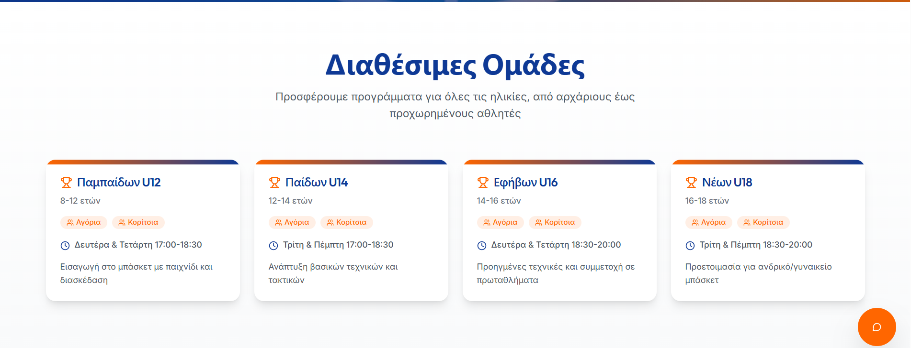
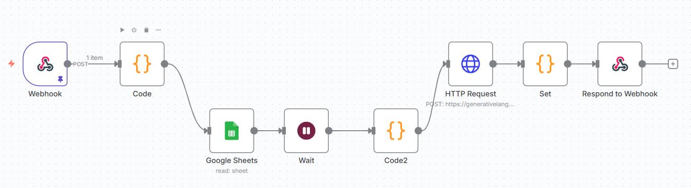

# 📸 Screenshots

<p align="center">
	
	
	
	
</p>

# Setup Guide – Αρκαδικός BC Basketball Academy AI Agent

This guide will help you set up the project locally, including the frontend, backend (n8n), and all required integrations.

---

## 1. Prerequisites

- **Node.js** (v18+ recommended)
- **npm** 
- **n8n** (self-hosted or cloud)
- **Google account** (for Sheets API)
- **Gemini API key** (Google Generative Language API)

---

## 2. Clone the Repository

```sh
git clone https://github.com/Mia1Dimit/basketball-academy-ai-agent.git
cd basketball-academy-ai-agent
```

---

## 3. Frontend Setup

```sh
cd frontend
npm install
```

### Start the development server

```sh
npm run dev
```

The app will be available at [http://localhost:5173](http://localhost:5173) (default Vite port).

---

## 4. n8n Workflow Setup

1. **Start n8n** (locally or in the cloud).
2. **Import the workflow**:  
	 - Go to n8n dashboard.
	 - Import `n8n-workflow/Basketball Academy Chatbot.json`.
3. **Set up credentials**:
	 - Add your Google Sheets service account.
	 - Add your Gemini API key as a credential (never hardcode in the workflow).
4. **Configure the webhook**:
	 - The chatbot expects the webhook at:  
		 `http://localhost:5678/webhook/basketball-chatbot`
	 - If you deploy n8n elsewhere, update the frontend API URL in `frontend/src/lib/utils.ts`.

---

## 5. Environment Variables & Secrets

- **Frontend**:  
	If you need to use any API keys, create a `.env` file in `frontend/` and add it to `.gitignore`.
- **n8n**:  
	Store all secrets (API keys, service account JSON) in n8n credentials, not in workflow files.

---

## 6. Sample Data

- The Google Sheet used for team data should match the structure expected by the workflow.
- You can duplicate the provided sample sheet or create your own.

---

## 7. Troubleshooting

- **Chatbot not responding?**  
	- Check n8n is running and the workflow is active.
	- Check the webhook URL matches the frontend config.
	- Check your API keys and Google Sheets permissions.

- **Frontend errors?**  
	- Make sure all dependencies are installed.
	- Check the browser console for errors.

---

## 8. Deployment

- Deploy the frontend to Vercel, Netlify, or your preferred host.
- Deploy n8n to a secure server or use n8n cloud.
- Update all URLs and credentials for production.

---

## 9. Support

For help, contact:  
- info@arkadikosbc.gr

---

# Enjoy the AI-powered basketball academy website!
